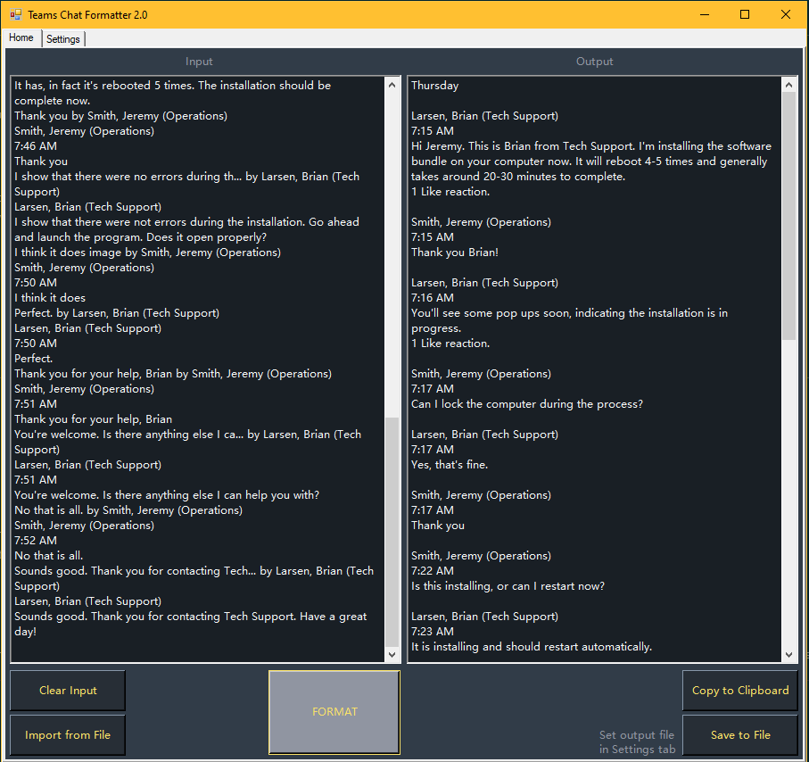

# PS-Tools
ps-tools contains a set of PowerShell commandlets designed to launch various custom tools. Each tool has a graphical interface implemented using Windows Forms. There are two modules, and each contains a group of commandlets.

    General Utilities: Contains the generic code needed to build all Windows forms, plus some extra functions and commandlets needed for specific form functionality.

    Forms: Specifies individual form configuration and button press functionality

The method for generating Windows forms from templates comes from Rod Meaney's article [Simple Form Development using PowerShell](https://devblogs.microsoft.com/powershell-community/simple-form-development.using-powershell/). This format allows new tools to be developed by simply creating a new Json file detailing the elements that should appear on the form, and a PowerShell file containing instructions for what happens when the buttons are clicked, etc.

Below are the details of the current custom forms contained in the ps-tools folder. The Teams Chat Formatter tool is the only one at the moment.

# Teams Chat Formatter
Teams Chat Formatter is a graphical tool used to format the transcript of a Microsoft Teams Chat into a more reader-friendly layout. The transcript can then be attached to a service desk incident ticket or other communication, etc.



## Details
Currently, copying the content of a chat in Teams results in one of two scenarios:
1. A large amount of metadata is gathered, resulting in duplicate message content and a confusing transcript.
2. No metadata about the conversation is collected at all, making it impossible to attribute messages outside of assumption through context.

The app applies the following formatting to the text:
- Summary lines about each message are removed. Lines are in the form: "[first several characters of the message]... by [last name], [first name] ([Business Unit])"
- Redundant lines showing the number of reactions for each reaction type are removed (reactions include things such as "liking" a message with a thumbs-up, etc.).
- Lines generated by the Teams app which are irrelevant to the conversation are removed.
    - "Last read": indicating the last message in the chat that was read by the user
    - "Has context menu": UI menu for quick response message buttons
- A newline is inserted before each new message for readability
- Clarification added to messages that were sent in response to other messages
- Sequential blank lines are condensed

## Launching the Tool
There are two ways to launch the tool.

#### 1. Script File
- Place the ps-tools folder in your desired location (e.g. C:\Users\username)
- Click the TeamsChatFormatter.ps1 file to select it
- Then in the File Explorer toolbar click "Copy path"
- Open a PowerShell terminal and enter "&", then paste the path to the script file and hit ENTER on the keyboard
- The tool will launch, and messages will appear in this PowerShell window as you use the tool

#### 2. Show-TeamsFormatter commandlet
- Place the ps-tools folder in your desired location (e.g. C:\Users\username)
- After importing the custom modules for this tool into the PowerShell terminal session, you can launch the Teams Chat Formatter simply by calling the proper commandlet (see "Automatically Import Modules" section below for details)

    e.g. ```PS C:\Users\username>Show-TeamsFormatter```


## Automatically Import Modules

You can instruct PowerShell to automatically load the ps-tools modules every time a new terminal window is opened. This allows you to launch the Teams Chat Formatter (or any other) tool simply by entering the commandlet name.

One of the benefits of this method is that autocomplete will now find the Show-TeamsFormatter commandlet. Start typing the name of the commandlet and press TAB until it appears.

#### Locate or create the profile.ps1 file
PowerShell checks specific locations for profile.ps1 files and immediately executes any commands they contain. You can see the locations of those file by checking the $PROFILE variable in a PowerShell terminal window. If the file does not exist, you can create it in the correct folder. Use the **CurrentUserAllHosts** location so that PowerShell performs the same actions regardless of which device you are signed into.

##### Get the correct path to the CurrentUserAllHosts profile location:
```PS C:\Users\username>$PROFILE.CurrentUserAllHosts```

If the file does not exist, create a new file with the name <em>profile.ps1</em>.

#### Add import statements to profile.ps1
- Once you have a profile.ps1 file in the proper location, add statements to import the desired modules.
- The current location of your ps-tools folder will determine what you enter.
- For this example, assume the files are in your home directory (i.e. C:\Users\username\ps-tools).
- Add these three lines of instructions to profile.ps1 (It's fine if these are the only lines of code in the file):

    <code>$forms = "$env:userprofile\ps-tools\Forms\Forms.psm1"<br />
$generalUtilities = "$env:userprofile\ps-tools\GeneralUtilities\GeneralUtilities.psm1"<br />
Import-Module -Name $forms, $generalUtilities</code>

Now you can launch the Teams Chat Formatter in any PowerShell terminal window using method 2 listed above.

## Usage
### Collecting the Input
The most important part of using this tool is making sure that all the information is copied from the Teams chat window. Any data that is not captured and placed into the Input box cannot be included in the formatting process.

Here are the recommended steps for capturing as much information about the chat as possible:
1. Highlight the Teams chat messages beginning with the date of the first message you want to capture (if possible), or the name of the user who posted the first message.
2. Do not try to capture too many messages at once or some of the messages might be excluded.
3. Before releasing the mouse button, copy the text using CTRL+C, then you can release the mouse button. This will capture the metadata about each message.
4. Paste the copied text into the Input box of the formatter tool or save it to a text file which can then be imported to the tool.

Importing a file will replace whatever content is in the Input box with the contents of the file.

There is a maximum size of 524 KB allowed in the Input textbox. This can be changed in the Show-TeamsFormatter.json configuration file under "MaxLength".

### Formatting the transcript
Apply the formatting rules to the transcript by pressing the Format button. The rules are applied only to the text currently in the Input box, so if you imported a file, the original file is not changed.

Pressing "Format" more than once will not produce new output since the rules have already been applied to the text. If the Input box is empty but the Output box is not, pressing "Format" will delete the text in the Output box.

### Capturing the Output
Click one of the buttons underneath the Output textbox to either copy the formatted transcript to your clipboard or save it to a text file.

Clicking "Save to File" does not prompt for a file name. Instead, it automatically saves the content to the file specified in the Settings tab. The purpose of this is to save time since the file is completely overwritten when selected as the output. For the most part, there is no reason to change the name of the file, only the content.

If you do want to change the output file destination, you can specify the path and file name in the Settings tab. A valid file path will be displayed, but a nonexistent file is not actually created until you click "Save to File".

## Change Notes
V 1.0 Initial command line tool
- Created basic formatting algorithm that matches text to regular expressions and formats the content.
- Single text file used for both the input and output.
- Text file can be passed as a paramter to the commandlet. Otherwise, a Select File window appears.
- Output file automatically opens in the default text editor.

V 1.1 Created Graphical User Interface
- Implemented modules containing PowerShell commandlets and functions within ps-tools for creating Windows Forms from template files
- Structured Teams Chat Formatter user interface and functionality based on existing command line utility.
- Removed file upload option.

V 1.2 Added Documentation, Functionality and Multiple Bug Fixes
- Added formatting rules to properly match text copied from Microsoft Teams in either Comfy or Compact Mode (Desktop or web app as well)
- Applied fix to formatting rules allowing them to work with text copied directly from Microsoft Teams or copled/imported from a text file.
- Added immport from file functionality.
- Applied fixed window size.
- Increased Input textbox max size from windows textbox default (32 KB) to 524 KB.
- Added Home and Settings tabs.
- Configured form to automatically save to default output file, and made the default file configurable via Select File window in Settings tab.
- Added default output file location to Json configuration file for persistence across PowerShell terminal sessions.
- Added README, documentation, and comments to all project files.

V 1.3 Created resizable App Window and Copy to Clipboard Function
- Added Copy to Clipboard button.
- Made the application window resizable.
- Moved the Teams Chat Formatter algorithm to a separate commandlet so it can be used by other tools.

V 1.4 Cosmetic Changes
- Fixed uneven margins surrounding  elements of the UI.
- Adjusted the Output file label in the Settings tab to be the same before and after changing the file path.

V 1.5 Additional Formatting Rules and App Version Number Displayed
- Added version number to app window title.
- Rearranged item-selection sequence when using TAB key.
- A space is now added above lines announcing a new date (full date only, not "Today", "Yesterday", or day of the week).
- Indicates when a message is a response to another message.

V 1.6 Adjusted Formatting Algorithm
- Fixed formatter algorithm to work with short business unit names in user's display name.
- Updated GeneralUtiltiies module files to allow resizing of all control elements, including those currently unused by Teams Chat Formatter.

V 2.0 Dark Mode
- Added custom colors to application interface.
